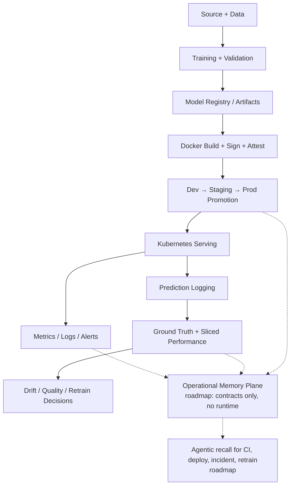

# ML-MLOps Production Template

Opinionated, production-grade template for building and operating ML systems on Kubernetes with multi-cloud deployment
(GKE + EKS), governed CI/CD, closed-loop monitoring, supply-chain security, and agentic automation that stays inside
enterprise guardrails.

[](https://github.com/DuqueOM/ml-service-template/releases)
[](https://www.python.org/downloads/)
[](LICENSE)
[](https://www.terraform.io/)
[](https://kubernetes.io/)

[](https://github.com/DuqueOM/ml-service-template/actions/workflows/validate-templates.yml)
<!-- codecov is keyed on the PRE-RENAME repo slug and does not follow GitHub's
     redirect. Verified by fetching both: the old path returns `40%`, the new
     `ml-service-template` path returns `unknown`. Do NOT "fix" this to match
     the other badges -- that breaks a working badge. It changes only when the
     codecov project itself is re-linked. -->
[](https://codecov.io/gh/DuqueOM/ML-MLOps-Production-Template)
[](https://github.com/DuqueOM/ml-service-template/generate)
[](#anti-patterns-encoded)
[](#agentic-system)

```bash
# scaffold a new ML service in under a minute
copier copy --vcs-ref=v0.31.0 https://github.com/DuqueOM/ml-service-template.git ChurnPredictor
# or: git clone + ./templates/scripts/new-service.sh ChurnPredictor churn_predictor
```

> **`--vcs-ref` is required, not decorative.** Without it Copier resolves to the highest-sorting tag, and this repo
> carries frozen `v1.0.0`–`v1.12.0` audit snapshots (ADR-014) alongside the active `v0.x` line. `v1.12.0` sorts above
> `v0.26.0`, so the bare command silently scaffolds an April 2026 snapshot — complete, plausible, and stale. Always pin
> the active version shown above; `scripts/check_adopter_scaffold_ref.py` keeps this snippet in sync with `VERSION`.

**Start here:** [Quick start](#quick-start) | [How it works, in four diagrams](docs/DIAGRAMS.md) |
[QUICK_START.md](QUICK_START.md) | [docs/TUTORIAL.md](docs/TUTORIAL.md) | [RUNBOOK.md](RUNBOOK.md) |
[AGENTS.md](AGENTS.md)

---

## Who this is for

This template is designed for ML engineers and platform teams that are past the experimentation phase and ready to
operate models with production discipline. The active public release line is `v0.x` hardening; `v1.0.0` is reserved for
the first release with real cloud E2E evidence on GKE and EKS.

It fits:

- a **team shipping its first production ML service** that wants strong defaults without building a platform from scratch
- a **platform team** standardizing how ML services are built, deployed, monitored, and governed across multiple squads
- a **solo engineer or tech lead** who needs a reference implementation to anchor technical decisions and ADRs

It is not designed for data science notebooks, batch-only pipelines, or teams that have already adopted a full ML
platform such as Vertex AI Pipelines or SageMaker Pipelines end-to-end. Two narrow on-ramps exist for the last two,
without diluting that scope: a [`batch-only` Kustomize overlay](templates/service/k8s/overlays/batch-only/) (ADR-036)
for teams that only need scheduled scoring, no live API; and [`docs/EXPORTING.md`](docs/EXPORTING.md), which documents
registering this template's own signed container image in Vertex AI Model Registry or as a SageMaker Model Package — the
artifacts travel, the orchestration does not.

---

## Quick start

### 1. Try the demo

```bash
make bootstrap
make demo-minimal
```

Or run the minimal example step by step:

```bash
cd examples/minimal
pip install -r requirements.txt
python train.py          # train and register the model artifact
uvicorn serve:app --host 0.0.0.0 --port 8000 &   # serve predictions
python drift_check.py    # verify drift detection baseline
```

### 2. Scaffold your own service

```bash
pip install copier  # one-time prerequisite
./templates/scripts/new-service.sh FraudDetector fraud_detector
cd FraudDetector
pytest
```

The scaffolder delegates to [Copier](https://copier.readthedocs.io/) for
project generation. It renders `templates/service/` with your service
name, sets up the agentic system, and runs post-generation validation.
A `.copier-answers.yml` file is created in the service directory — keep
it committed so you can absorb template improvements via `copier update`
(or the `/scaffold-update` workflow).

### 3. Wire your environment

Before deploying to a cloud environment, configure the following. Runbooks for each step live under `docs/runbooks/`.

- cloud identity federation (Workload Identity or IRSA)
- remote Terraform state backend
- secret store integrations
- MLflow tracking and registry backend
- observability backends (Prometheus, Grafana, Alertmanager)
- GitHub Environment protections and required reviewers

---

## Quick navigation

| If you want to... | Read first | Then |
| ------------------- | ------------ | ------ |
| See how it works before reading it | [docs/DIAGRAMS.md](docs/DIAGRAMS.md) | [QUICK_START.md](QUICK_START.md) |
| Orient yourself — Day 1 to Month 2 | [docs/PROGRESSION.md](docs/PROGRESSION.md) | [QUICK_START.md](QUICK_START.md) |
| Scaffold a new ML service | [QUICK_START.md](QUICK_START.md) | `copier copy` or `./templates/scripts/new-service.sh` |
| Follow the narrated tutorial | [docs/TUTORIAL.md](docs/TUTORIAL.md) | [QUICK_START.md](QUICK_START.md) |
| Understand the operating model | [AGENTS.md](AGENTS.md) | [docs/decisions/](docs/decisions/) |
| Review deployment and rollback flow | [RUNBOOK.md](RUNBOOK.md) | `templates/service/.github/workflows/` and `templates/k8s/` |
| Evaluate security posture | [SECURITY.md](SECURITY.md) | `templates/service/infra/`, `templates/k8s/`, `templates/service/.github/workflows/` |
| Extend agentic behavior | [AGENTS.md](AGENTS.md) | `templates/config/agentic_manifest.yaml`, `agentic/`, generated surfaces |
| Contribute to the template | [CONTRIBUTING.md](CONTRIBUTING.md) | License and governance sections below |
| Cut a release | [docs/RELEASING.md](docs/RELEASING.md) | [CHANGELOG.md](CHANGELOG.md) |
| Migrate from a prior version | [MIGRATION.md](MIGRATION.md) | [CHANGELOG.md](CHANGELOG.md) |
| Verify what has actually been executed | [VALIDATION_LOG.md](VALIDATION_LOG.md) | [docs/audit/ACTION_PLAN_R4.md](docs/audit/ACTION_PLAN_R4.md) |

---

## Architecture overview



Dashed edges are roadmap: the Operational Memory Plane ships its contracts and redaction pipeline today, not a
runtime (see its section below). Four diagrams take the solid part apart step by step — the deploy chain and how it
stays verifiable, how identity and secrets resolve without a stored credential, how the monitoring loop closes, and
what governs the agentic surface: [docs/DIAGRAMS.md](docs/DIAGRAMS.md).

### Design principles

- The training, serving, monitoring, and retraining path is explicit and reviewable.
- The scaffolded repository is self-contained. It does not depend on hidden files from the template root after generation.
- The template uses strong defaults for production invariants and lets teams customize domain features, schema, model
  selection, thresholds, and integrations.
- Governance is additive. Dynamic signals can escalate a decision to a safer mode; they cannot silently weaken policy.

---

## What this template is

This repository is a reference template for teams that want strong production defaults without adopting a heavyweight ML
platform too early. It is intentionally opinionated where production failures are expensive and intentionally flexible
where teams need domain-specific control.

It ships:

- Async ML serving patterns that avoid common Kubernetes and FastAPI failure modes.
- Multi-cloud Kubernetes and Terraform scaffolding for GCP and AWS.
- Environment promotion from `dev → staging → prod` with audit trail, approvals, digest-based deploys, signing, and attestations.
- Closed-loop monitoring with prediction logging, delayed ground truth, sliced performance, champion/challenger
  evaluation, and retraining hooks.
- Security controls for secrets, identity federation, SBOM generation, image signing, admission policy, and pod hardening.
- Agentic governance through `AUTO / CONSULT / STOP`, plus dynamic risk escalation based on live signals.

The template ALSO includes two **Phase 1 / contracts-only** capabilities — they are explicitly NOT runtime today, and
the runtime work is gated on adopter feedback before opening Phase 2:

- Safe CI self-healing — see ADR-019. Today: classifier + policy contracts ship; runtime is shadow-only and writes nothing.
- Operational Memory Plane — see ADR-018. Today: `MemoryUnit` dataclass + redaction pipeline ship; ingest worker, vector
  store, and retrieval API are deferred.

If your adoption decision depends on either capability being live, the answer is "not yet" — they are roadmap items
shipped as reviewable contracts, not as production features.

This is not a generic starter repo. It is a production template with encoded operating constraints.

---

## Production-ready scope

This is a hardened open-source baseline for enterprise-style ML services. The matrix below reports two distinct things:

1. **Designed-ready (verified L1+L2+L3)**: the patterns are contract-tested in this repo, render cleanly through
   `kustomize build`, and pass the golden-path E2E in kind. This is what every entry below means by default.
2. **Verified end-to-end (L4)**: the component has been exercised against a real cloud account, real cluster, real
   traffic. **Today, no entry below claims L4.** The L4 paper trail is owned by the adopter — see `VALIDATION_LOG.md`.

The previous wording ("Production-ready by design") was reworked in the May 2026 audit because reviewers consistently
read the row as "production-ready, full stop," which over-promised the L4 gap.

| Area | Status | What that means |
| ------ | -------- | ----------------- |
| Service scaffold | Designed-ready (L1+L2+L3) | FastAPI serving, async inference, contract versioning, structured errors, domain hooks, tests, observability, and the explicit [`FASTAPI_TEMPLATE_CONTRACT.md`](docs/FASTAPI_TEMPLATE_CONTRACT.md) are wired as first-class concerns. |
| Kubernetes runtime | Designed-ready (L1+L2+L3) | Single-worker pod model, split probes, startup gating, PDB, HPA, pod security labels, digest-pinned deploys, drift CronJob with PSS-restricted securityContext + init-container data fetch (May 2026 audit), and non-root runtime defaults are part of the base. |
| Multi-cloud infrastructure | Designed-ready (L1+L2+L3) | GCP and AWS both ship with environment separation, remote state, identity federation, secret manager patterns, and reproducible Terraform layouts. L4 cluster rollout is the adopter's responsibility. |
| CI/CD | Designed-ready (L1+L2+L3) | Build, scan, sign, attest, promote, smoke-test, drift-check, retrain (with audit trail + cosign blob signing of model artifacts after the May 2026 audit), and audit paths are governed and traceable. |
| Closed-loop monitoring | Designed-ready (L1+L2+L3) | Prediction logging, ground-truth ingestion, sliced performance analysis, drift heartbeat, and champion/challenger comparisons are part of the standard operating model. |
| Security and supply chain | Designed-ready (L1+L2+L3) | Secret scanning, SBOM, image signing, admission policy, **hard-fail trivy/checkov IaC scanning with explicit baselines** (May 2026 audit HIGH-1), and least-privilege cloud identity are part of the deploy contract. |
| Agentic controls | Designed-ready (L1+L2+L3) | Static operation modes, dynamic risk escalation (with auth+TLS-pinned Prometheus signal source after May 2026 audit), typed handoffs, and auditable decisions are all encoded. |
| Agentic CI self-healing | Roadmap — Phase 1 contracts only | Classifier + policy contracts ship in shadow / read-only mode (ADR-019). NO writes, NO PRs, NO branch mutations today. Patch worker / verifier / write-enabled lanes are NOT implemented and are gated on 14 days of shadow precision data. |
| Operational Memory Plane | Roadmap — Phase 1 contracts only | `MemoryUnit` dataclass + secret and PII redaction pipeline ship (ADR-018). Ingest worker, vector store, retrieval API are NOT implemented. Adopters cannot call retrieval APIs today; the design page describes the target shape, not a live capability. |

External dependencies remain your responsibility: cloud accounts, Kubernetes clusters, MLflow backend, secret stores,
and observability backends must exist before the template can operate in a real environment.

### Verification status

Four verification layers. Inside this repo the author can guarantee the first three; the fourth is per-adopter and
cannot be asserted template-wide.

| Layer | Scope | Where it runs | Evidence in this repo |
| ------- | ------- | --------------- | ---------------------- |
| **L1 — Contract tests** | Invariants on generated service code, schemas, policies, and agentic config | `.github/workflows/validate-templates.yml`; `templates/service/tests/test_*.py`; `make validate-templates` locally | Contract tests covering FastAPI serving invariants, memory (ADR-018), CI self-healing (ADR-019), model-routing disclaimer, Phase-0/1 disclosure, anti-pattern count consistency, Locust ↔ API parity, PR evidence policy, CI autofix policy |
| **L2 — Scaffold smoke** | End-to-end scaffold of a fresh service + every overlay rendered + kubeconform + binary audit | `.github/workflows/pr-smoke-lane.yml` on every PR; `make smoke` on demand (~60 s) | Green per PR; history in the Actions tab |
| **L3 — Golden path E2E** | Full chain: scaffold → build → sign → attest → deploy to kind → rollout Available → `/health` + `/ready` + `/predict` 2xx + metrics smoke | `.github/workflows/golden-path.yml` on release tags / schedule | Shipped; uses an explicit CI-only synthetic model fallback so runtime checks do not depend on cloud buckets |
| **L4 — Adopter production rollout** | Your cluster, your traffic, your SLOs, your compliance regime | Your CD pipeline + observability stack | **Not assertable from this repo.** Checklist lives in [`VALIDATION_LOG.md`](VALIDATION_LOG.md) §"Template for future entries" and [`docs/runbooks/`](docs/runbooks/). The R4 audit documents which runbooks are still pending execution by the author (secrets-integration-e2e, ground-truth ingestion SLA, Kyverno admission validation, secret history scan). |

If you are an adopter deciding whether to stake a production service on this template: L1 + L2 + L3 are your contract;
L4 is an obligation the template cannot discharge for you. The `docs/audit/ACTION_PLAN_R4.md` + `VALIDATION_LOG.md` pair
is the paper trail for what has already been executed vs. what is only shipped as policy.

### Release history

What each release closed, with file-level evidence, is recorded per version in [CHANGELOG.md](CHANGELOG.md) and
[`releases/`](releases/); what has actually been executed, as opposed to shipped as policy, is in
[VALIDATION_LOG.md](VALIDATION_LOG.md). The README does not restate it, because a release summary here is stale the
day the next release ships.

### Optional: Progressive delivery (Argo Rollouts)

`argo-rollout.yaml` ships in `templates/service/k8s/base/` with full security parity to `deployment.yaml` (PSS
restricted, init containers, `model-verifier`), but it is **opt-in** — it is intentionally NOT in
`kustomization.yaml#resources` because it and `deployment.yaml` cannot coexist (they own the same Pods). Enabling is a
deliberate swap.

Enable when you need canary deploys with metric-gated rollback, want to exercise the shipped champion/challenger
`AnalysisTemplate`, or have an SRE rotation that cannot be paged for a metric regression a Rollout could have caught at
30 % traffic. Do not enable for single-replica, low-traffic services.

See [`docs/runbooks/progressive-delivery.md`](docs/runbooks/progressive-delivery.md) for the full enable procedure (base
swap, overlay patch rename, verification steps, failure paths).

---

## Core capabilities

### Serving and APIs

- Async FastAPI serving with `run_in_executor` for CPU-bound inference.
- Explicit FastAPI template contract for required endpoints, feature
  parity, auth, readiness, CORS, error envelope, metrics, and prediction
  logging: [`docs/FASTAPI_TEMPLATE_CONTRACT.md`](docs/FASTAPI_TEMPLATE_CONTRACT.md).
- Single-worker pod model for correct HPA behavior.
- Request validation, contract versioning, snapshot-based API checks, and structured error envelopes.
- Model loading through init containers and shared volumes instead of baking models into images.
- Warm-up path for model readiness and SHAP explainer caching.

### Kubernetes and runtime

- Kustomize base plus an overlay for each cloud and environment (`gcp-dev`, `gcp-staging`, `gcp-prod`, `aws-dev`,
  `aws-staging`, `aws-prod`) and a `batch-only` overlay for scheduled scoring.
- CPU-only HPA, PodDisruptionBudget, NetworkPolicy, RBAC, non-root security context, and Pod Security Standards labels.
- Separate liveness, readiness, and startup probes.
- Digest-based deployment and immutable image flow.

### Infrastructure

- Terraform layouts separated by cloud and environment concerns.
- Remote state patterns for both GCP and AWS.
- Workload Identity and IRSA as the default runtime identity model.
- Example resource topology for buckets, registries, clusters, IAM, and observability prerequisites.

### CI/CD and controlled automation

- Build → scan → sign → attest → deploy → smoke-test promotion chain.
- Drift detection and retraining workflows as first-class operational paths.
- Audit trail written to JSONL and surfaced in GitHub Actions summaries.
- CI self-healing is roadmap: a failure classifier runs in shadow mode and writes nothing (see below).

### Data validation and ML quality

- Pandera-based contracts for data validation.
- Leakage checks, baseline distributions, reproducibility hooks, and configurable quality gates.
- Fairness checks, champion/challenger evaluation, and retraining evidence packages.
- Versioned artifacts and model promotion rules that are designed to fail closed.

### Observability and closed-loop monitoring

- Prometheus metrics, structured logs, Grafana dashboards, and alert rules.
- Prediction logging with `prediction_id` and `entity_id` as required primitives.
- Delayed ground-truth ingestion, sliced performance monitoring, heartbeat monitoring, and trend analysis.
- Metrics and alerts designed for incident response and governed promotion.

### Security and supply chain

- Secret scanning, vulnerability scanning, SBOM generation, Cosign signing, and attestation.
- Admission-policy-oriented deployment posture.
- Least-privilege identity patterns for cloud access.
- Clear separation of dev, staging, and production credentials and approval paths.

### Technology stack

| Layer | Technologies | Coverage |
| ------- | ------------- | ---------- |
| ML and training | Python 3.11+, scikit-learn, XGBoost, LightGBM, Optuna | baseline models, ensembles, hyperparameter tuning |
| Serving and API | FastAPI, Uvicorn, Pydantic | async inference, contract validation, structured responses |
| Explainability | SHAP | feature attribution in original feature space |
| Data validation | Pandera, pandas, DVC | schema contracts, dataset versioning, reproducible pipelines |
| Model registry | MLflow, joblib | experiment tracking, model registry, serialized artifacts |
| Containers | Docker, multi-stage builds | image build, non-root runtime, init-container model loading |
| Kubernetes runtime | Kubernetes, Kustomize, HPA, PDB, NetworkPolicy | deployment, autoscaling, resilience, network isolation |
| Infrastructure | Terraform, GKE, EKS, GCS, S3, Artifact Registry, ECR | cloud provisioning, remote state, multi-cloud environment separation |
| Observability | Prometheus, Grafana, Alertmanager, Evidently | metrics, dashboards, alerting, drift and performance monitoring |
| CI/CD and security | GitHub Actions, Trivy, Syft, Cosign, Kyverno, gitleaks | build, scan, sign, attest, policy enforcement, secret detection |

---

## Agentic system

The template treats agent behavior as an engineering surface, not a prompt configuration.

The governance pattern is now single-source:

- `AGENTS.md` is the behavioral authority.
- `agentic/` stores canonical rule, skill, and workflow bodies (ADR-027).
- `templates/config/agentic_manifest.yaml` declares which surfaces consume each asset.
- Every supported IDE or agent reads a **generated** adapter, never a hand-edited copy. Which tools are supported and
  what each receives is listed once, with counts the coherence gate reconciles, under
  [AGENTS.md § Multi-IDE Support](AGENTS.md#multi-ide-support).

Run `make agentic-sync` after changing the manifest or canonical `agentic/` files, then `make validate-agentic` to prove
parity. Today the manifest exposes the same 19 rules + 27 skills + 20 workflows to Devin, Cursor, Claude, and
Codex. The project shorthand "18 rules" refers to the numbered policy set; on disk, rule 04 is split into serving and
training files, which is why the file count is 19.

### Static decision protocol

Every operation maps to one of three modes:

| Mode | Meaning | Examples |
| ------ | --------- | ---------- |
| `AUTO` | Safe to execute without waiting for approval | scaffolding, docs, tests, local training, lint, read-only inspection |
| `CONSULT` | Propose plan and rationale, then wait for approval | staging deploys, workflow changes with moderate blast radius, non-prod infra changes |
| `STOP` | Block and require explicit human governance | production infra changes, quality-gate override, secret rotation, destructive cloud actions |

### Dynamic escalation

The template supports live escalation based on risk signals including:

- severe drift
- active incident
- exhausted error budget
- recent rollback
- off-hours deployment
- suspicious quality signals
- detected credential pattern

Dynamic escalation only moves toward a safer mode. It never downgrades a risky action.

### Typed handoffs and auditability

- Inter-agent handoffs use typed dataclasses instead of ad-hoc dictionaries.
- Every meaningful operation produces an audit entry.
- Consulted or blocked operations can be surfaced as GitHub issues with evidence.

### Model routing

Which class of model handles which agentic task — a cheap router for triage, a stronger reviewer for diffs, frontier
models only for escalation, preview models never on a protected branch — is a policy in
[`templates/config/model_routing_policy.yaml`](templates/config/model_routing_policy.yaml), explained in
[docs/agentic/model-routing.md](docs/agentic/model-routing.md). A generated service never calls a language model; this
governs the maintenance lanes only.

See [AGENTS.md](AGENTS.md) for the canonical operation matrix and invariant catalog.

---

## Operational Memory Plane

> **Status — Phase 1 (contracts + redaction).** The canonical `MemoryUnit` dataclass and the gitleaks + PII redaction
> pipeline ship today: `templates/service/common_utils/memory_types.py` and
> `templates/service/common_utils/memory_redaction.py`, contract-tested by `test_memory_contracts.py` and
> `test_memory_redaction.py` for immutability, severity normalization, sensitivity ≥ bucket-ACL minimum, single-tenant
> Phase 1 scope, idempotent redaction, and structural isolation from the `/predict` path. The ingest worker, the vector
> store, the retrieval API, and any agent-facing recall surface are **NOT yet implemented** in this template and are
> explicitly deferred per ADR-018 §Phase plan. Adopters cannot call retrieval APIs today; the design page describes the
> **target shape** so the policy is reviewable before code lands. See
> [`ADR-018`](docs/decisions/ADR-018-operational-memory-plane.md) §Phase plan for the staged delivery.
>
> *Audit trail: Phase 0 disclosure added in response to R4 finding C2; transitioned to Phase 1 in the same audit-r4 sprint. See [`docs/audit/ACTION_PLAN_R4.md`](docs/audit/ACTION_PLAN_R4.md) §S0-2 + §S2-1.*

The target design — what it is, what it is not, and how it will be used — is in
[docs/agentic/memory-plane.md](docs/agentic/memory-plane.md); the decision and its staged delivery are in
[ADR-018](docs/decisions/ADR-018-operational-memory-plane.md).

---

## Agentic CI self-healing

> **Status — Phase 1 (shadow, read-only).** The classifier and collector ship today: `scripts/ci_collect_context.py` and
> `scripts/ci_classify_failure.py`, governed by `templates/config/ci_autofix_policy.yaml` and
> `templates/config/model_routing_policy.yaml`, and contract-tested by `test_ci_autofix_policy_contract.py` and
> `test_ci_classify_failure_phase1.py`. The classifier is wired
> into CI in **shadow mode only** — it observes failures and emits classifications, but **does NOT write code, does NOT
> open PRs, does NOT mutate any branch**. The patch worker, verifier, and write-enabled lanes are **NOT implemented
> yet** and are gated on 14 days of shadow data per ADR-019 §Phase plan. No agent will autonomously open a PR against
> your CI today. See [`ADR-019`](docs/decisions/ADR-019-agentic-ci-self-healing.md) §Phase plan for the staged delivery.
>
> *Audit trail: Phase 0 disclosure added in response to R4 finding C2; transitioned to Phase 1 in the same audit-r4 sprint. See [`docs/audit/ACTION_PLAN_R4.md`](docs/audit/ACTION_PLAN_R4.md) §S0-2 + §S1-6.*

The target design — what it is, what it is not, and how it will be used — is in
[docs/agentic/ci-self-healing.md](docs/agentic/ci-self-healing.md); the decision and its staged delivery are in
[ADR-019](docs/decisions/ADR-019-agentic-ci-self-healing.md).

---

## Anti-patterns encoded

The template encodes and audits 38 production anti-patterns across serving, training, Kubernetes, Terraform, security,
observability, and delivery.

| ID | Anti-pattern | Corrective action |
| ---- | -------------- | ------------------- |
| D-01 | `uvicorn --workers N` in Kubernetes | Use one worker per pod and move CPU-bound inference into `ThreadPoolExecutor`. |
| D-02 | Memory as an HPA metric for ML pods | Use CPU-only HPA so scale-down remains meaningful. |
| D-03 | `model.predict()` called directly in an async endpoint | Wrap inference with `run_in_executor`. |
| D-04 | `shap.TreeExplainer` with ensemble or pipeline models | Use `KernelExplainer` with a stable prediction wrapper. |
| D-05 | Exact `==` version pinning for ML dependencies | Use compatible release pinning (`~=`) and automate updates through Dependabot. |
| D-06 | Unrealistically high primary metric | Treat as a leakage investigation, not as a promotion win. |
| D-07 | SHAP background sample contains only one class | Replace with a representative background sample. |
| D-08 | PSI computed with uniform bins | Use quantile-based bins derived from the reference distribution. |
| D-09 | Drift detection without heartbeat alerting | Add heartbeat alerting for broken or stalled CronJobs. |
| D-10 | `terraform.tfstate` committed to Git | Move state to remote storage and rotate exposed credentials immediately. |
| D-11 | Model artifacts baked into the Docker image | Download models at runtime through init containers and shared volumes. |
| D-12 | No quality gates before promotion | Enforce metrics, fairness, leakage, and integrity gates before deploy. |
| D-13 | EDA executed directly on production data | Work from an isolated copy under `data/raw/` and keep EDA out of prod paths. |
| D-14 | Pandera schema without observed bounds from EDA | Add observed ranges and constraints derived from exploratory analysis. |
| D-15 | Baseline distributions not persisted for drift | Save and version baseline distributions for drift consumers. |
| D-16 | Feature engineering without rationale | Document feature proposals and tie them to EDA evidence. |
| D-17 | Hardcoded credentials in code or config | Use secret manager integrations through shared utilities. |
| D-18 | Static AWS keys or GCP JSON keys in production | Use IRSA on AWS and Workload Identity on GCP. |
| D-19 | Unsigned images or missing SBOM in production | Sign images, generate SBOMs, and enforce them at admission time. |
| D-20 | Prediction logs missing `prediction_id` or `entity_id` | Require both fields for traceability and ground-truth joins. |
| D-21 | Prediction logging blocks the async event loop | Buffer and flush logging asynchronously in the background. |
| D-22 | Logging backend failure leaks into the HTTP response path | Swallow logging failures and surface them as observability counters. |
| D-23 | Shared liveness and readiness endpoint | Split `/health`, `/ready`, and startup gating for warm-up correctness. |
| D-24 | SHAP explainer rebuilt on every request | Build once during warm-up and reuse from application state. |
| D-25 | Pod can be terminated mid-request | Keep `terminationGracePeriodSeconds` above the graceful shutdown timeout. |
| D-26 | Deploys bypass staging validation | Enforce dev → staging → prod promotion with environment approvals. |
| D-27 | Deployment ships without a PodDisruptionBudget | Require a PDB and sane minimum replica assumptions. |
| D-28 | Breaking API change without version bump and snapshot refresh | Refresh the OpenAPI snapshot and apply semantic version discipline. |
| D-29 | Namespace missing Pod Security Standards labels | Label namespaces and enforce the correct pod security level by environment. |
| D-30 | Production image lacks SBOM attestation | Attach a CycloneDX SBOM attestation as part of the signed release chain. |
| D-31 | Monolithic IAM identity for ci/deploy/runtime/drift/retrain | Per-purpose, per-environment service accounts with WIF (GCP) and IRSA (AWS); enforced by `tests/test_iam_least_privilege.py`. |
| D-32 | K8s manifests reference Python paths with kebab-case placeholders | Python module paths use `{service}` (snake), never `{service-name}` (kebab); enforced by `tests/policy/test_anti_patterns.py::test_d32_drift_cronjob_python_path`. |
| D-33 | Manual file copying or sed-based placeholder substitution in the scaffolder | The scaffolder (`templates/scripts/new-service.sh`) MUST delegate to `copier copy`. Manual `cp -r` + `sed -i` cannot handle conditional logic, directory renaming, or upgrade paths. Enforced by `scripts/test_scaffold.sh`. |
| D-34 | Unquoted Jinja tokens in YAML list items | All `{@ @}` tokens in YAML lists MUST be quoted: `- "{@ service_name @}"`. Unquoted tokens are invalid YAML. Enforced by `rg -n '^\s*- \{@' templates/service/ --glob "*.yml"` returning zero hits. |
| D-35 | `local` stack profile accepts cloud credentials or targets a cluster | A `local` profile MUST have `requires.kubernetes`, `requires.docker`, `requires.terraform` all `false` and `deploy.enabled` is `false`. Enforced by `tests/policy/test_anti_patterns.py::test_d35_local_profile_no_cloud_deps`. |
| D-36 | Promoting, tagging, or deploying without verified-green CI, or overriding red/missing without STOP-class approval | `/release` and `deploy-gke`/`deploy-aws` (staging/prod) invoke `ci-green-verify` (AUTO) as a hard precondition; an override MUST produce a `scripts/audit_record.py` entry. Enforced by the wiring in `agentic/workflows/release.md` + the deploy skills' Step 0 (ADR-039). |
| D-37 | Non-English documentation or a private/personal repo reference committed to `docs/` or a root doc | This repo's documentation is English-only; a private companion repo must never be named or linked here. Enforced by `scripts/check_doc_coherence.py` C7 (ADR-040). |
| D-38 | Public inference Ingress without an edge-protection component, or disabling/loosening an existing WAF/rate-limit rule | Native-cloud-first: Cloud Armor (GCP) / AWS WAFv2 + Shield Standard (AWS) by default via opt-in Kustomize Components; Cloudflare optional for genuine multi-cloud. `terraform apply` is CONSULT in every environment; disabling a rule is STOP in every environment. Enforced by `tests/policy/test_anti_patterns.py::test_d38_edge_component_carries_implementation_annotation` (ADR-042). |

The full invariant text and operating rules live in [AGENTS.md](AGENTS.md).

---

## How this compares

Four open-source projects are widely treated as references in the MLOps space. They are excellent, and this template
deliberately borrows ergonomics from each — through its own canonical layer, never by forking them (see
[ADR-029](docs/decisions/ADR-029-agentic-adoption-contract.md)). They optimize for different things:

| | This template | [Made With ML](https://github.com/GokuMohandas/Made-With-ML) | [Cookiecutter Data Science](https://github.com/drivendataorg/cookiecutter-data-science) | [ZenML](https://github.com/zenml-io/zenml) | [Kubeflow](https://github.com/kubeflow/kubeflow) |
| --- | --- | --- | --- | --- | --- |
| **Primary optimization** | Production discipline + governance | Teaching the *why* | Recognizable project structure | Infra-agnostic pipelines | Full ML platform (pipelines, KServe, Katib) |
| **Production hardening** | leader | medium | low | medium | high |
| **Multi-cloud (GKE + EKS)** | leader | no | no | via stacks | via distro |
| **Governance / supply chain** | unique (AUTO/CONSULT/STOP, 38 anti-patterns, cosign/SBOM/Kyverno) | low | no | medium | low (platform, not policy) |
| **Entry friction** | medium (local-first profile, `copier copy`) | medium | very low | low | very high (needs a platform team) |
| **Standardized scaffolding** | Copier | n/a | de-facto | CLI | n/a |
| **Pedagogy / learning arc** | narrated tutorial + anti-pattern walk-through | leader | medium | good | low |

**What makes this template special** — and what no reference above ships — is the agentic spine: a vendor-neutral
canonical rule store ([ADR-027](docs/decisions/ADR-027-vendor-neutral-canonical-surface.md)) read natively by Cursor,
Devin, Claude Code, and Codex, governed by a three-mode behavior protocol (AUTO/CONSULT/STOP) with dynamic risk
escalation, and 38 contract-tested anti-patterns.

**Where we are improving adoption** — standardized scaffolding (Copier), a local-first on-ramp (stack profiles), a
recognizable layout, and a guided tutorial — is tracked transparently in
[`docs/audit/ACTION_PLAN_ADAPTABILITY.md`](docs/audit/ACTION_PLAN_ADAPTABILITY.md). Every one of those improvements is
required to flow through the canonical agentic layer, so adoption ergonomics never dilute the governance that
differentiates the template.

If you want a guided course on ML fundamentals, start with Made With ML. If you want a minimal, deployment-agnostic
project skeleton, start with Cookiecutter Data Science. If you want orchestrator portability, look at ZenML. If you have
a dedicated platform team and want a full ML platform (pipelines, KServe, Katib), graduate to Kubeflow or Vertex AI
Pipelines. If you want a **governed, production-hardened, multi-cloud service template with an agentic operating
model**, you are in the right place.

### Tools we compose with, not against

Two adjacent tools are complementary rather than alternatives, and are tracked as deliberate seams:

- **[BentoML](https://github.com/bentoml/BentoML)** — best-in-class model packaging and serving DX (adaptive batching,
  `bentoml.Service`). Our serving path (FastAPI + `asyncio.run_in_executor` + `ThreadPoolExecutor`) is correct and
  dependency-light, but BentoML is evaluated as an *optional alternative serving backend* behind the same K8s/HPA
  invariants (1 worker, CPU-only HPA, init-container model load) — see
  [ADR-032](docs/decisions/ADR-032-bentoml-alternative-serving-backend.md). The stance is *evaluate, don't mandate*.
- **[Evidently](https://github.com/evidentlyai/evidently)** — already used for drift and data-quality checks; the drift
  workflow can additionally emit an Evidently HTML report as a reviewer-friendly artifact (roadmap).

---

## Release and operate

Typical flow:

1. Build and test in CI.
2. Scan dependencies and container image.
3. Generate SBOM and sign by digest.
4. Deploy to `dev`.
5. Promote to `staging` with approval.
6. Validate smoke tests, SLOs, and quality signals.
7. Promote to `prod` through protected environments.
8. Monitor closed-loop metrics, drift, and incident signals.
9. Retrain only through the governed quality gate path.

Deploy, incident, and retrain are part of one operating model, not separate ad-hoc scripts.

**SCM-level protection** sits beneath this flow as a one-time setup: see
[`docs/decisions/ADR-026-branch-protection.md`](docs/decisions/ADR-026-branch-protection.md)
for the two GitHub Rulesets the template ships (main-branch-baseline +
tag-immutability-v). Adopters apply both to their fork with
`make setup-github` once `gh auth login` is configured.

---

## Adoption boundary

For platform reviewers asking *"is this ready for our org?"* and teams that want to adopt the template **without using
AI agents**, see [`docs/ADOPTION.md`](docs/ADOPTION.md). It contains:

- **Maturity matrix** per capability × cloud × environment (dev/staging/prod), with explicit `ready` / `partial` /
  `roadmap` ratings
- **Non-agentic on-ramp**: every `/slash` workflow has a `make` equivalent or runbook reference; teams that don't use AI
  assistants get the same safety guarantees through `make` targets and contract tests
- **Explicit non-claims**: what the template does NOT cover (multi-region active-active, compliance certifications, LLM
  serving, mobile/edge inference). *LLM serving is intentionally out of scope here; the agent work that needs it lives in
  [`ml-platform`](https://github.com/DuqueOM/ml-platform) — see "Companion repositories" below.*

The agentic surface is a productivity multiplier; it is not a load-bearing component of the template's safety
guarantees. All production invariants (D-01..D-38) live in tests, CI workflows, and Kyverno policies — not in agent
behavior.

---

## Scope boundaries

**Included:**

- single-service and small-to-medium team MLOps patterns
- multi-cloud Kubernetes deployment (GKE and EKS)
- production CI/CD, supply-chain security, monitoring, and retraining paths
- agentic governance and bounded automation for Devin, Cursor, Claude Code, and Codex

**Not included by default:**

- full workflow orchestration platforms (Airflow, Prefect, Kubeflow Pipelines)
- feature store platform ownership
- multi-region active-active failover
- complex canary meshes beyond the documented rollout boundary
- compliance programs that require dedicated legal or regulated tooling

If you outgrow the template, the documented invariants and ADRs are designed to survive that transition.

---

## Real-world origin

This template was extracted from [ML-MLOps-Portfolio](https://github.com/DuqueOM/ML-MLOps-Portfolio), where the patterns
were developed and validated across multiple ML services, ADRs, tests, and cloud deployments.

The goal is not to mirror that portfolio one-to-one. The goal is to package the stable, reusable operating patterns into
a template that other teams can adopt without starting from scratch.

### Companion repositories

This template is one product in a connected line. They share an operating
philosophy (engineering calibration, ADRs for every non-trivial decision,
AUTO/CONSULT/STOP governance) but stay deliberately separate:

| Repository | Role | Relationship to this template |
| ------------ | ------ | ------------------------------- |
| [ML-MLOps-Portfolio](https://github.com/DuqueOM/ML-MLOps-Portfolio) | The 3 validated tabular-ML services | Source the template was extracted from |
| **this template** | Reusable MLOps platform (multi-cloud K8s, supply chain, agentic governance) | — |
| [ml-platform](https://github.com/DuqueOM/ml-platform) | Multi-project ML platform monorepo — the work above this template's single-service boundary | **Consumes** this template through `copier`; where the two disagree on serving, containers, manifests or supply chain, this template wins |
| [agent-local](https://github.com/DuqueOM/agent-local) | Standalone local-LLM agent core | Its core moved into ml-platform, which is now authoritative; agent-local is a one-way export of it — see [docs/agentic/model-routing.md](docs/agentic/model-routing.md#local-model-plane) |

---

## Repository structure

Two trees: the template repository that builds and governs, and the payload under `templates/service/` that Copier
renders into a generated service. Both are mapped, path by path, in
[docs/REPOSITORY_STRUCTURE.md](docs/REPOSITORY_STRUCTURE.md) — written so that a path which stops existing fails CI.

---

## Contributing

This project uses the Developer Certificate of Origin (DCO).

By contributing, you certify that:

- you have the right to submit your contribution
- you agree to license your work under the Apache License 2.0

All commits must be signed off:

```bash
git commit -s -m "your message"
```

This adds the required `Signed-off-by` line to your commit. No CLA is required.

See [CONTRIBUTING.md](CONTRIBUTING.md) for the full contribution process, issue templates, and ADR conventions.

Questions and discussion: [file an issue](https://github.com/DuqueOM/ml-service-template/issues/new/choose).

---

## License

This project is licensed under the Apache License 2.0. See the [LICENSE](LICENSE) file for details.

---

## AI transparency

This repository is intentionally designed for human-governed, AI-assisted engineering.

- Agents accelerate repetitive work.
- Policies, tests, reviews, and audit logs constrain agent autonomy.
- Architecture, risk acceptance, and production accountability remain human responsibilities.

The goal of this template is safer automation, not ungoverned automation.
