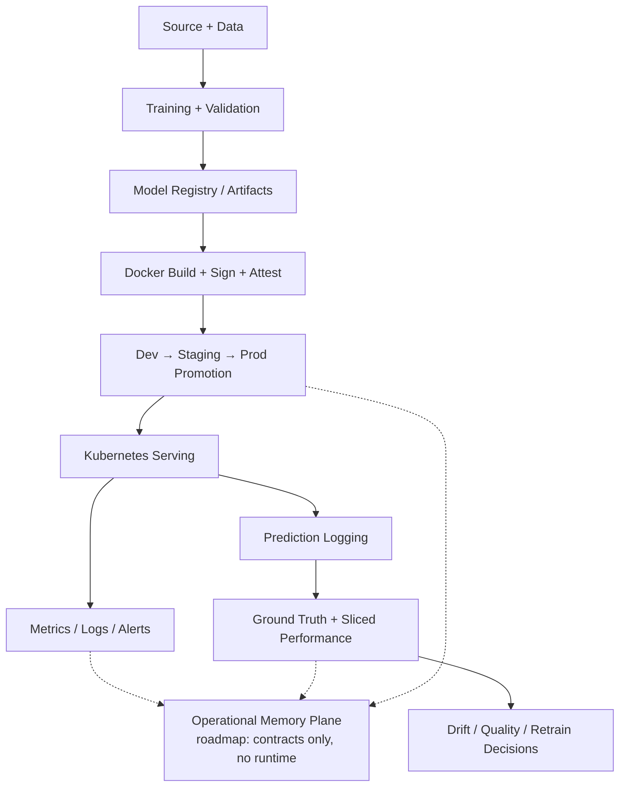

# ml-service-template

> A governed Copier template for one production ML service on Kubernetes, on GKE and EKS.

[](https://github.com/DuqueOM/ml-service-template/actions/workflows/validate-templates.yml)
[](https://github.com/DuqueOM/ml-service-template/releases)
[](https://www.python.org/downloads/)
[](LICENSE)
[](AGENTS.md#anti-patterns-that-agents-must-detect-and-correct)

## Status

<!-- BEGIN README STATUS -->
<!-- Generated by `python3 scripts/check_readme.py --write` from VERSION, CHANGELOG.md,
     docs/ADOPTION.md, AGENTS.md, .github/workflows/ and VALIDATION_LOG.md.
     Edit those, then regenerate; never edit this block. -->

**v0.31.0**, released 2026-09-29 — [CHANGELOG](CHANGELOG.md), [releases](releases/).

**Production maturity, per capability: 39 ready · 3 partial · 5 roadmap** of 47, rated per cloud and environment in the
[adoption matrix](docs/ADOPTION.md). **38 anti-patterns** encoded and contract-tested ([AGENTS.md](AGENTS.md)).

Verified in this repository: L1 contract tests (`validate-templates.yml`) · L2 scaffold smoke (`pr-smoke-lane.yml`) · L3
golden path on kind (`golden-path.yml`). **L4, your cloud and your traffic, is not assertable from this repository** —
it is the adopter's to run and record.

Latest execution record: [VALIDATION_LOG.md](VALIDATION_LOG.md), Entry 020 — v0.26.0: closing the tag-namespace
collision (ADR-045).
<!-- END README STATUS -->

## What it is

An opinionated, production-grade template for building and operating **one** ML service on Kubernetes, with
multi-cloud deployment (GKE and EKS), governed CI/CD, closed-loop monitoring, supply-chain security, and agentic
automation that stays inside enterprise guardrails. Opinionated where production failures are expensive, flexible
where teams need domain-specific control. A generated service is self-contained: it depends on no hidden file from
the template after generation, and absorbs template improvements through `copier update`.

**For** ML engineers and platform teams past the experimentation phase: a team shipping its first production ML
service, a platform team standardising how squads build and operate services, or a tech lead who needs a reference
implementation to anchor decisions. **Not for** notebooks, batch-only pipelines without a live API, or teams already
on a full ML platform such as Vertex AI Pipelines or SageMaker Pipelines end to end — though a `batch-only` overlay
(ADR-036) and [docs/EXPORTING.md](docs/EXPORTING.md) give those last two a narrow on-ramp. Several services sharing
libraries, orchestration and LLM work is [ml-platform](https://github.com/DuqueOM/ml-platform), which consumes this
template.

Two capabilities ship as **contracts only, not runtime**: the **Operational Memory Plane** (Phase 1 — the
`MemoryUnit` contract and redaction pipeline; ingest, vector store and retrieval are not implemented) and
**CI self-healing** (Phase 1 — a classifier in shadow mode that writes nothing; no agent opens a PR against your CI).
If an adoption decision depends on either being live, the answer is "not yet" — see [What you get](#what-you-get).

### Adoption boundary

Platform reviewers asking *"is this ready for our org?"*, and teams adopting **without AI agents**, start with
[docs/ADOPTION.md](docs/ADOPTION.md): the maturity matrix per capability, cloud and environment; a `make` equivalent
for every agentic workflow; and the explicit non-claims (multi-region active-active, compliance certifications, LLM
serving, mobile and edge inference). The agentic surface is a productivity multiplier, not a load-bearing part of
the safety guarantees: every production invariant (each D-NN in AGENTS.md) lives in tests, CI workflows and Kyverno
policies.

## Quick start

```bash
pip install "copier>=9.0.0"                 # exactly what CI's scaffold lanes install
copier copy --vcs-ref=v0.31.0 https://github.com/DuqueOM/ml-service-template.git ChurnPredictor
cd ChurnPredictor
pip install -r requirements-dev.txt         # the generated service's own pins, as the smoke lane installs them
pytest tests/test_fastapi_template_contract.py
```

Copier asks for the service's snake_case name and the GitHub owner that will host it. The last command runs the
generated service's FastAPI contract test, which the Scaffolder End-to-End job in `validate-templates.yml` runs on every
PR.

**`--vcs-ref` is required, not decorative.** Without it Copier resolves to the highest-sorting tag, and this
repository keeps frozen `v1.0.0`–`v1.12.0` audit snapshots (ADR-014) beside the active `v0.x` line, so the bare
command silently scaffolds a stale snapshot. `scripts/check_adopter_scaffold_ref.py` keeps the pinned version above
equal to `VERSION`. Keep the generated `.copier-answers.yml` committed so `copier update` (or `/scaffold-update`)
can bring later releases in.

[QUICK_START.md](QUICK_START.md) has each track step by step; [docs/PROGRESSION.md](docs/PROGRESSION.md) goes from
day one to month two; [docs/CAPABILITIES.md](docs/CAPABILITIES.md#what-you-must-provide-before-a-cloud-deploy)
lists what a cloud deploy needs from you first.

## What you get

| Area | Maturity | What ships |
| ------ | -------- | ----------------- |
| Service scaffold | Designed-ready (L1+L2+L3) | Async FastAPI serving, contract versioning, structured errors, domain hooks, tests — the [FastAPI template contract](docs/FASTAPI_TEMPLATE_CONTRACT.md) |
| Kubernetes runtime | Designed-ready (L1+L2+L3) | Single-worker pods, split probes, startup gating, PDB, CPU-only HPA, PSS labels, digest-pinned deploys, init-container model loading, an overlay per cloud and environment |
| Multi-cloud infrastructure | Designed-ready (L1+L2+L3) | Terraform for GCP and AWS with environment separation, remote state, Workload Identity and IRSA, secret managers. L4 rollout is the adopter's |
| CI/CD | Designed-ready (L1+L2+L3) | Build, scan, sign, attest, promote `dev → staging → prod`, smoke-test, drift-check and retrain, with an audit trail |
| Closed-loop monitoring | Designed-ready (L1+L2+L3) | Prediction logging, delayed ground truth, sliced performance, drift heartbeat, champion/challenger |
| Security and supply chain | Designed-ready (L1+L2+L3) | Secret scanning, SBOM, Cosign signing, Kyverno admission, hard-fail Trivy and Checkov with explicit baselines, least-privilege identity |
| Agentic controls | Designed-ready (L1+L2+L3) | AUTO / CONSULT / STOP, dynamic risk escalation, typed handoffs, auditable decisions, one canonical surface rendered for Claude, Cursor, Codex and Devin |
| Agentic CI self-healing | Roadmap — Phase 1 contracts only | Classifier and policy contracts in shadow, read-only mode. No writes, no PRs, no branch mutations |
| Operational Memory Plane | Roadmap — Phase 1 contracts only | `MemoryUnit` and the redaction pipeline. Ingest, vector store and retrieval API are not implemented |

"Designed-ready" means contract-tested, rendered and run end to end on kind here — not exercised in your cloud.
Every area in detail, the technology stack, the full anti-pattern catalogue and how this compares with Made With ML,
Cookiecutter Data Science, ZenML and Kubeflow: [docs/CAPABILITIES.md](docs/CAPABILITIES.md).

### Operational Memory Plane

> **Status — Phase 1 (contracts + redaction).** The `MemoryUnit` dataclass and the gitleaks + PII redaction pipeline
> ship (`common_utils/memory_types.py`, `memory_redaction.py`), contract-tested. The ingest worker, vector store,
> retrieval API and any agent-facing recall are **not yet implemented**, deferred per
> [ADR-018](docs/decisions/ADR-018-operational-memory-plane.md) §Phase plan. Target design:
> [docs/agentic/memory-plane.md](docs/agentic/memory-plane.md).

### Agentic CI self-healing

> **Status — Phase 1 (shadow, read-only).** The collector and classifier ship (`scripts/ci_collect_context.py`,
> `scripts/ci_classify_failure.py`), wired into CI in **shadow mode only**: they classify failures and write nothing —
> no code, no PRs, no branch mutations. The patch worker, verifier and write-enabled lanes are **not implemented**,
> gated on shadow precision data per [ADR-019](docs/decisions/ADR-019-agentic-ci-self-healing.md) §Phase plan.
> Target design: [docs/agentic/ci-self-healing.md](docs/agentic/ci-self-healing.md).

## Architecture



Dashed edges are roadmap. Governance is additive: dynamic signals can escalate a decision to a safer mode, never
silently weaken it. Two trees — the template that builds and governs, and the payload under `templates/service/`
that Copier renders — are mapped path by path in [docs/REPOSITORY_STRUCTURE.md](docs/REPOSITORY_STRUCTURE.md);
[docs/DIAGRAMS.md](docs/DIAGRAMS.md) takes the deploy chain, identity, the monitoring loop and the agentic surface
apart in four diagrams; every decision is an ADR in [docs/decisions/](docs/decisions/).

## How claims are verified

### Verification status

| Layer | Scope | Where it runs | Evidence |
| ------- | ------- | --------------- | ---------------------- |
| **L1 — Contract tests** | Invariants on generated code, schemas, policies, agentic config | `validate-templates.yml`; `make validate-templates` | Contract tests, including every anti-pattern |
| **L2 — Scaffold smoke** | A fresh scaffold, every overlay rendered, kubeconform, binary audit | `pr-smoke-lane.yml` on every PR; `make smoke` | Green per PR |
| **L3 — Golden path E2E** | Scaffold → build → sign → attest → deploy to kind → `/health`, `/ready`, `/predict` | `golden-path.yml` on release tags and schedule | A CI-only synthetic model, so no cloud bucket is needed |
| **L4 — Adopter production rollout** | Your cluster, your traffic, your SLOs | Your CD pipeline | **Not assertable from this repository.** The checklist is in [VALIDATION_LOG.md](VALIDATION_LOG.md) and [docs/runbooks/](docs/runbooks/) |

L1 to L3 are your contract; L4 is an obligation the template cannot discharge for you.

- **Every anti-pattern is a test.** Each D-NN in [AGENTS.md](AGENTS.md) names the policy test or CI check that
  enforces it, and the count shown above is reconciled against the catalogue by `scripts/check_doc_coherence.py`.
- **Documents cannot drift from their sources.** Rule 16 names one source of truth per restated fact — version,
  anti-pattern count, agentic surface counts, ADR set — and the coherence gate fails CI when a mirror disagrees.
- **What was executed is recorded apart from what ships as policy**, in [VALIDATION_LOG.md](VALIDATION_LOG.md), and
  audits with their action plans are in [docs/audit/](docs/audit/).

## Documentation

| Purpose | Start with |
| --- | --- |
| **Tutorials** — learn by doing | [QUICK_START.md](QUICK_START.md), [docs/TUTORIAL.md](docs/TUTORIAL.md), [docs/PROGRESSION.md](docs/PROGRESSION.md) |
| **How-to guides** — get a task done | [RUNBOOK.md](RUNBOOK.md), [docs/runbooks/](docs/runbooks/), [docs/RELEASING.md](docs/RELEASING.md), [MIGRATION.md](MIGRATION.md), [docs/EXPORTING.md](docs/EXPORTING.md), [docs/environment-promotion.md](docs/environment-promotion.md) |
| **Reference** — look something up | [docs/CAPABILITIES.md](docs/CAPABILITIES.md), [docs/FASTAPI_TEMPLATE_CONTRACT.md](docs/FASTAPI_TEMPLATE_CONTRACT.md), [docs/REPOSITORY_STRUCTURE.md](docs/REPOSITORY_STRUCTURE.md), [CHANGELOG.md](CHANGELOG.md), [VALIDATION_LOG.md](VALIDATION_LOG.md) |
| **Explanation** — understand why | [Decisions (ADRs)](docs/decisions/), [docs/DIAGRAMS.md](docs/DIAGRAMS.md), [docs/ADOPTION.md](docs/ADOPTION.md), [docs/COMPLIANCE_MAPPING.md](docs/COMPLIANCE_MAPPING.md), [model routing](docs/agentic/model-routing.md) |
| **For agents** | [AGENTS.md](AGENTS.md), [llms.txt](llms.txt) |

This README follows the [README standard](docs/governance/readme-standard.md) it shares with ml-platform.

## Related repositories

<!-- BEGIN RELATED REPOSITORIES -->
| Repository | Role |
| --- | --- |
| [ML-MLOps-Portfolio](https://github.com/DuqueOM/ML-MLOps-Portfolio) | End-to-end tabular ML services where these patterns were first proven; ml-service-template was extracted from it |
| [ml-service-template](https://github.com/DuqueOM/ml-service-template) | A governed Copier template for **one** tabular ML service on Kubernetes, on GKE and EKS |
| [ml-platform](https://github.com/DuqueOM/ml-platform) | A multi-project ML platform template: shared libraries, orchestration and governance under projects of different kinds. It consumes ml-service-template for serving, and where the two disagree on serving, containers, manifests or supply chain, ml-service-template is authoritative |
| [agent-local](https://github.com/DuqueOM/agent-local) | A local multi-tier LLM agent core with a deterministic policy gate. Its core moved into ml-platform, which is now authoritative; agent-local is a one-way export of it |
<!-- END RELATED REPOSITORIES -->

## Contributing, security and support

- **Contributing**: [CONTRIBUTING.md](CONTRIBUTING.md) — issue templates, ADR conventions, and the Developer
  Certificate of Origin: every commit is signed off (`git commit -s`); no CLA. [Code of conduct](CODE_OF_CONDUCT.md).
- **Security**: report a vulnerability privately as [SECURITY.md](SECURITY.md) describes — never in a public issue.
- **Support**: [file an issue](https://github.com/DuqueOM/ml-service-template/issues/new/choose). Maintained by
  [@DuqueOM](https://github.com/DuqueOM).
- **AI transparency**: built for human-governed, AI-assisted engineering. Agents accelerate repetitive work;
  policies, tests, reviews and audit logs constrain them; architecture, risk acceptance and production
  accountability stay with people.

## License

[Apache-2.0](LICENSE).
