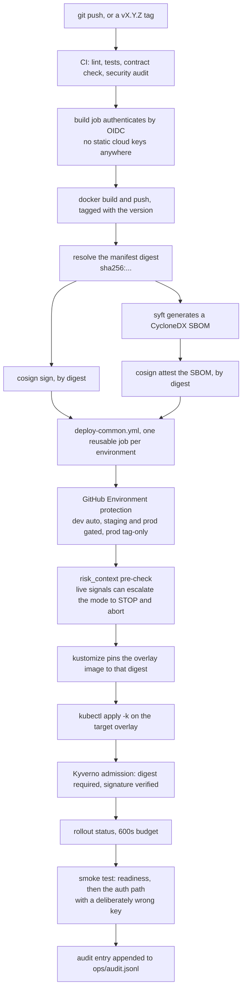
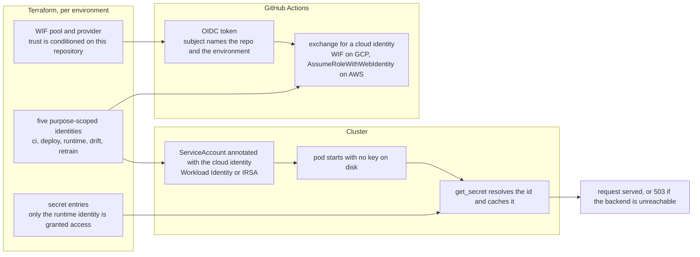
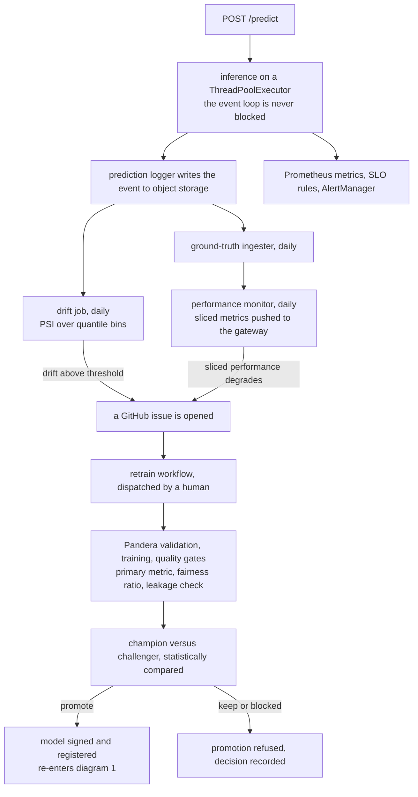
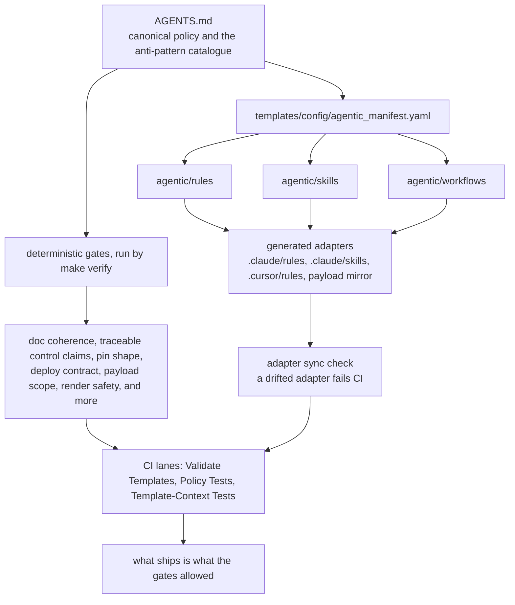

# How the template works, in four diagrams

The rest of the documentation explains this template in prose, and prose is
the right format for a contract. It is the wrong format for the first hour.
This page is the first hour: four diagrams that show what actually happens,
each followed by the files that implement it, so a reader can go from picture
to source without searching.

Every diagram describes behaviour that exists in the tree today. Where a step
is optional or an adopter has to wire it, the diagram says so rather than
drawing it as if it were already running.

- [1. From a commit to a pod you can verify](#1-from-a-commit-to-a-pod-you-can-verify)
- [2. Who the code is, and where its secrets come from](#2-who-the-code-is-and-where-its-secrets-come-from)
- [3. The loop that closes](#3-the-loop-that-closes)
- [4. What governs the agent](#4-what-governs-the-agent)

---

## 1. From a commit to a pod you can verify

The deploy chain has one property worth understanding before any other: the
thing that is signed, the thing that is scanned and the thing that is admitted
to the cluster are the **same bytes**, because every step after the build
addresses the image by its digest rather than by its tag. A tag can be moved;
a digest cannot.

Two nodes are the adopter's to wire, and the diagram would be dishonest
without saying so. **Reviewer counts** live in GitHub's Environment settings,
not in the repository: the workflow declares the environment and names the
intended posture (dev automatic, staging one reviewer, production two plus a
wait timer), and an adopter who never configures those environments gets no
approval step. The **tag-only gate on production** is enforced in the
repository, twice — once as a job condition and once as a guard inside the
deploy job. **Kyverno** admits nothing until its policies are installed in the
cluster; they ship in `templates/k8s/policies/`.

Two other steps exist because the obvious version of them failed:

- **The digest pin.** Building, signing and then deploying a *tag* leaves a
  window in which the tag can point somewhere else. The build job emits a
  `service -> digest` map, and the deploy job rewrites the overlay with it
  before applying.
- **The smoke test's second probe.** Readiness alone went green on a
  deployment whose every authenticated request failed, because readiness never
  touches the secret backend. The second probe sends a key that is
  deliberately wrong: `401` proves the secret resolved and the comparison ran,
  `503` proves it did not. CI never holds the real key.

Files: [`templates/service/.github/workflows/deploy-gcp.yml`](../templates/service/.github/workflows/deploy-gcp.yml),
[`deploy-aws.yml`](../templates/service/.github/workflows/deploy-aws.yml),
[`deploy-common.yml`](../templates/service/.github/workflows/deploy-common.yml),
[`templates/k8s/policies/kyverno-image-verification.yaml`](../templates/k8s/policies/kyverno-image-verification.yaml).

---

## 2. Who the code is, and where its secrets come from

There is no credential file in this template — not in the repository, not in
the image, not on the node. Every actor proves its identity to the cloud with
a short-lived token, and the identities are separate on purpose: the job that
detects drift cannot read the API key, and the job that retrains cannot delete
a model.

The part that is easy to get wrong is the **name**. Terraform decides what a
secret is called, and the pod has to ask for the same string — on GCP the
prefix and the key are joined with `-`, on AWS with `/`. That join lives in
one function, `secret_id()`, and a contract test evaluates the Terraform
interpolations against the Kubernetes overlays so the four layers cannot
quietly choose four different names.

Failure is closed, not open: if the secret backend cannot be reached in
staging or production, the service answers `503` rather than falling back to
an unauthenticated path.

Files: [`templates/service/common_utils/secrets.py`](../templates/service/common_utils/secrets.py),
[`templates/service/infra/terraform/gcp/wif.tf`](../templates/service/infra/terraform/gcp/wif.tf),
[`templates/service/infra/terraform/aws/iam-roles-split.tf`](../templates/service/infra/terraform/aws/iam-roles-split.tf),
[`templates/service/tests/test_runtime_identity_contract.py`](../templates/service/tests/test_runtime_identity_contract.py),
[`docs/decisions/ADR-051-runtime-identity-and-secret-addressing.md`](decisions/ADR-051-runtime-identity-and-secret-addressing.md).

---

## 3. The loop that closes

A monitoring setup that only emits metrics is an open loop: it can tell you
that something changed, but nothing downstream is obliged to act. This one
closes, and it closes through artefacts a human can read — a GitHub issue, a
quality-gate report, a champion-versus-challenger decision — rather than
through an automatic push to production.

The fairness gate uses a disparate impact ratio with a floor of `0.80` — the
US four-fifths rule. The generated service's `fairness.py` says plainly that
this is a starting point and not a universal threshold, and lists what the
metric cannot see: it is a group-level measure, it is unreliable on small
subgroups, and passing it does not by itself make a model fair.

Files: [`templates/service/k8s/base/cronjob-drift.yaml`](../templates/service/k8s/base/cronjob-drift.yaml),
[`cronjob-performance.yaml`](../templates/service/k8s/base/cronjob-performance.yaml),
[`templates/service/.github/workflows/drift-detection.yml`](../templates/service/.github/workflows/drift-detection.yml),
[`retrain-service.yml`](../templates/service/.github/workflows/retrain-service.yml),
[`templates/service/scripts/promote_model.sh`](../templates/service/scripts/promote_model.sh).

---

## 4. What governs the agent

The agentic surface is not load-bearing. Agents make the work faster; the
gates decide what ships. Everything an agent reads is generated from one
canonical tree, and a check fails CI when a generated adapter stops matching
its source — so a rule cannot be softened in one IDE's copy without the
difference showing up in a diff.

The same idea applies to the documentation you are reading. The coherence gate
reconciles claims that appear in more than one document — the version, the
anti-pattern count, the agentic surface counts, ADR numbering — against the
tree, so a number stated on this page cannot drift away from the directory it
describes without CI saying so.

Files: [`AGENTS.md`](../AGENTS.md),
[`templates/config/agentic_manifest.yaml`](../templates/config/agentic_manifest.yaml),
[`scripts/sync_agentic_adapters.py`](../scripts/sync_agentic_adapters.py),
[`scripts/check_doc_coherence.py`](../scripts/check_doc_coherence.py),
[`Makefile`](../Makefile).

---

## Where to go next

| You want to... | Go to |
| ---------------- | ------- |
| Run something in ten minutes | [QUICK_START.md](../QUICK_START.md) |
| Read the contract behind diagram 1 | [RUNBOOK.md](../RUNBOOK.md) |
| Read the contract behind diagram 2 | [docs/runbooks/gcp-wif-setup.md](runbooks/gcp-wif-setup.md), [aws-irsa-setup.md](runbooks/aws-irsa-setup.md) |
| Read the contract behind diagram 4 | [AGENTS.md](../AGENTS.md) |
| See why each decision was made | [docs/decisions/](decisions/) |
